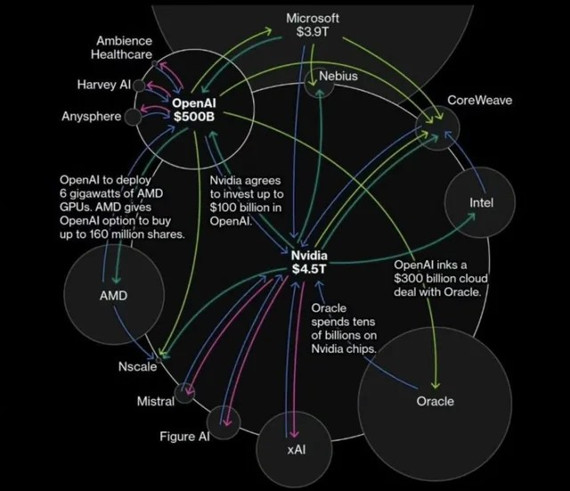

# AI Financial Bubble and Hype Cycles
## *Project Overview*
This paper analyzes the emergence of a potential AI financial bubble by examining investment patterns, infrastructure costs, and hype cycles surrounding large language models (LLMs). It explores how rapid adoption following the release of ChatGPT accelerated capital inflows into AI companies, driving record valuations among major technology firms such as OpenAI, NVIDIA, Microsoft, Google, and IBM.

The analysis investigates the economic sustainability of large-scale AI systems by breaking down operational costs, including GPU infrastructure, energy consumption, personnel expenses, and API pricing models. Special attention is given to the environmental and financial burden associated with training and deploying frontier AI models, highlighting the growing gap between operational costs and short-term profitability.
Beyond financial metrics, the paper addresses ethical and societal implications, including taxpayer exposure through indirect government support, rising public debt, and the environmental impact of large-scale AI computation. By comparing current trends with historical speculative periods such as the dot-com bubble, the paper evaluates whether AI’s rapid growth reflects unsustainable hype or a long-term structural shift.
The findings suggest that while speculative behavior and risks are present, AI represents a strategic technological frontier with long-term economic and geopolitical importance, making a sudden collapse less likely than often portrayed in popular media

  

## *Technologies Used*
  This project utilizes Python as the primary programming language, with matplotlib for generating visualizations and seaborn for enhancing and customizing the graphical presentation. Historical stock price data are retrieved using yfinance, while pandas is used for data ingestion, preprocessing, and analysis.

## *Graphs*
  The graphs presented in the paper provide a deeper understanding of the growth experienced by major AI companies before and after the emergence of generative AI. This comparison enables a clearer evaluation of whether the observed acceleration in valuations is driven by genuine technological advancement or primarily the result of speculative market behavior.

  

  

The paper also examines the broader economic dynamics of the AI ecosystem, highlighting how capital circulates between major AI companies through infrastructure spending, cloud services, and hardware investments. It explores the role of government funding, emphasizing how public tax dollars indirectly support these companies and contribute to their continued expansion.
Additionally, the paper discusses ethical concerns surrounding corporate structures, noting how some organizations—such as OpenAI—have operated under nonprofit or hybrid models, allowing them to significantly reduce tax obligations while still benefiting from large-scale private and public investment. This raises important questions about transparency, accountability, and the financial burden ultimately placed on ordinary citizens.

  

